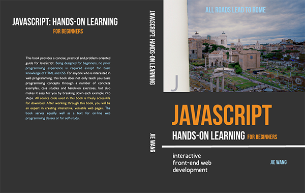

# JavaScript Hands-on Learning: interactive front-end web development 
{:class="img-responsive"}
<h3> <a href="https://www.amazon.com/dp/0998273805/ref=sr_1_1?ie=UTF8&qid=1477092514&sr=8-1&keywords=9780998273808">Available at Amazon</a></h3>

This full color book provides a concise, practical and problem-oriented guide for JavaScript. Being designed for beginners, no prior programming experience is required except for basic knowledge of HTML and CSS. For anyone who is interested in web programming, this book does not only teach you basic programming concepts through a number of concrete examples, case studies and hands-on exercises, but also makes it easy for you by breaking down each example into steps. The book serves equally well as a text for online web programming classes or for self-study. All source code used in this book is freely accessible for download.
The book contains twelve chapters covering topics from basic programming concepts to interactive web application development. Each chapter is built upon the previous one. For beginners, it is recommended to read through from the first chapter to the last chapter without skipping pages or chapters. After working through this book, you will have a strong foundation in web development and become an expert in creating interactive, versatile web pages.

<h3>Errata: </h3>
<ol>
<li>Page 40: 4. Open c2w4.html
<li>Page 41: Replace the ref value css/ex-1.css with css/c2w4.css
<li>Page 82: seatsAvailable calculates and returns the number of....
<li>Page 86: seatsAvailable calculates and returns the number of....
<li>Page 89: 3.....seatsAvailable calculates <u>and returns</u> the number of ....
<li>Page 99: 3) section.speedpanel: A section having the class name 'speedpanel' includes two div elements, div.speed and div.controls. The element div.controls includes....
<li>Page 105: in the folder case1
<li>Page 187: Workout 8-2: Replace the line "var start = 1;" with "var end = 10;".
</ol>

Copyright and license. 
Code and documentation copyright 2016

